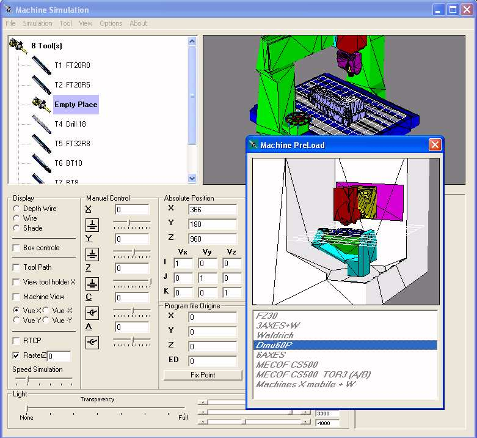



## A 5 axis milling machine simulator

### Description

It's a simulation software for 5 axis milling machine. I'm using OpenGL library and especially the function glGetDoublev glgModelViewMatrix, Matrix(1) to get back the Opengl matrix.

Tool and tool holder are created via standard Opengl function like gluSphere, gluDisk,and gluCylinder .. The elements of the milling machines are created via STL ascii file and you will find in the source code some samples of ISO code and STL part.

I'm sorry because all the code and comments are in french but if I have any time and if someone is interresting I will try to translate the code in english.

It's of course a Beta release full of bugs and limitations.

You can find the zip file at :

http://5axes.free.fr/devel_machine/Machine-en.zip

Just some informations concerning the dynamic manipulation

Clic on the PictureBox with the left button to move the machine.

The zoom function is attached to the right button.

Press the shift key + the left button it's a rotation against X and Y

Shift key + right button = rotation against Z axis

Regards
 
### More Info
 
It's of course a Beta release full of bugs and limitations.

All is In the Zip File but I have some trouble To upload the zip file.

For the moment you can find the zip file at :

http://5axes.free.fr/devel_machine/Machine-en.zip

             |
---                |---
**Submitted On**   |2004-01-15 17:31:42
**By**             |[CUQ](https://github.com/Planet-Source-Code/PSCIndex/blob/master/ByAuthor/cuq.md)
**Level**          |Advanced
**User Rating**    |4.9 (64 globes from 13 users)
**Compatibility**  |VB 6\.0
**Category**       |[Miscellaneous](https://github.com/Planet-Source-Code/PSCIndex/blob/master/ByCategory/miscellaneous__1-1.md)
**World**          |[Visual Basic](https://github.com/Planet-Source-Code/PSCIndex/blob/master/ByWorld/visual-basic.md)
**Archive File**   |[A\_5\_axis\_m1695191162004\.zip](https://github.com/Planet-Source-Code/cuq-a-5-axis-milling-machine-simulator__1-51046/archive/master.zip)

